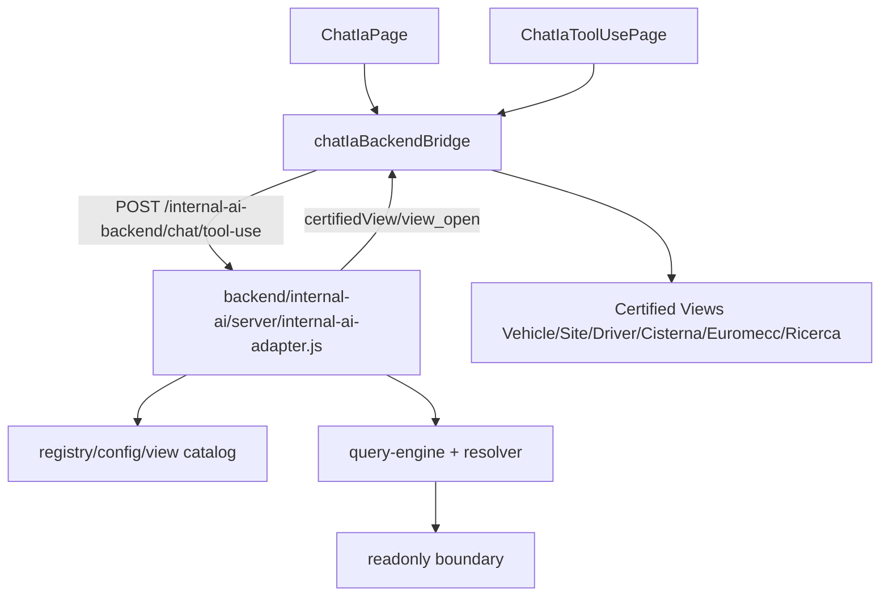

# DIAGRAMMI FLUSSI DATI NEXT

Data: 2026-05-07

Questi diagrammi rappresentano solo flussi dimostrati nel codice NEXT. Le label indicano lettura o scrittura verso dataset reali.

## 1. Panoramica dataset condivisi NEXT

```mermaid
flowchart TD
  App[App.tsx /next routes]
  Shell[NextShell]
  App --> Shell
  Shell --> Centro[Centro Controllo]
  Shell --> Magazzino[Magazzino]
  Shell --> Manutenzioni[Manutenzioni]
  Shell --> Dossier[Dossier Mezzo]
  Shell --> Procurement[Procurement]
  Shell --> Anagrafiche[Anagrafiche]
  Shell --> Autisti[Autisti Admin/InBox]
  Shell --> Cisterna[Cisterna]
  Shell --> Euromecc[Euromecc]
  Shell --> Chat[Chat IA]

  Mezzi[(storage/@mezzi_aziendali)]
  Inventario[(storage/@inventario)]
  Materiali[(storage/@materialiconsegnati)]
  ManutData[(storage/@manutenzioni)]
  Ordini[(storage/@ordini)]
  Rifornimenti[(storage/@rifornimenti)]
  DocumentiMezzi[(@documenti_mezzi)]

  Anagrafiche -->|scrive| Mezzi
  Magazzino -->|scrive| Inventario
  Magazzino -->|scrive| Materiali
  Manutenzioni -->|scrive| ManutData
  Manutenzioni -->|scala/scrive| Inventario
  Manutenzioni -->|scrive movimenti| Materiali
  Procurement -->|scrive| Ordini
  Euromecc -->|genera ordine| Ordini
  Autisti -->|consolida| Rifornimenti
  Dossier -->|legge| Mezzi
  Dossier -->|legge| ManutData
  Dossier -->|legge| Materiali
  Dossier -->|legge| Rifornimenti
  Dossier -->|legge| DocumentiMezzi
  Chat -->|richiede viste certificate| BackendIA[backend/internal-ai]
```

## 2. Manutenzioni -> Magazzino -> Dossier/Centro

```mermaid
flowchart TD
  ManPage[NextManutenzioniPage]
  ManDomain[nextManutenzioniDomain]
  ManPage --> ManDomain
  ManDomain -->|legge/scrive| Manut[(storage/@manutenzioni)]
  ManDomain -->|legge/scrive se materiali| Inv[(storage/@inventario)]
  ManDomain -->|legge/scrive movimenti| Mat[(storage/@materialiconsegnati)]
  ManDomain -->|legge metadata| DocMezzi[(@documenti_mezzi)]

  Mag[NextMagazzinoPage]
  Mag -->|legge/scrive| Inv
  Mag -->|legge/scrive| Mat

  Dossier[NextDossierMezzoPage]
  Dossier -->|legge manutenzioni/gomme| Manut
  Dossier -->|legge materiali| Mat

  Centro[NextCentroControlloParityPage]
  Centro -->|legge eventi e scadenze aggregate| Manut
```

Fonti: `nextManutenzioniDomain.ts:978-994`, `nextManutenzioniDomain.ts:1012-1088`, `NextMagazzinoPage.tsx:1588-1602`, `nextDossierMezzoDomain.ts:770-776`.

## 3. Magazzino e movimenti materiali

```mermaid
flowchart TD
  Mag[NextMagazzinoPage]
  Inv[(storage/@inventario)]
  Consegnati[(storage/@materialiconsegnati)]
  AdBlue[(storage/@cisterne_adblue)]
  StorageFoto[(Firebase Storage foto materiali)]
  Operativita[NextOperativitaGlobalePage]
  Dossier[NextDossierMezzoPage]
  Manut[NextManutenzioniPage]

  Mag -->|persistInventario| Inv
  Mag -->|persistConsegne| Consegnati
  Mag -->|persistCambi| AdBlue
  Mag -->|uploadInventarioPhoto| StorageFoto
  Operativita -->|legge| Inv
  Operativita -->|legge| Consegnati
  Dossier -->|legge| Consegnati
  Manut -->|legge inventario workspace| Inv
```

Fonti: `NextMagazzinoPage.tsx:803-815`, `:1588-1611`, `nextOperativitaGlobaleDomain.ts:345-349`.

## 4. Procurement, preventivi e ordini

```mermaid
flowchart TD
  MaterialiDaOrd[NextMaterialiDaOrdinarePage]
  ProcurementPanel[NextProcurementReadOnlyPanel]
  PreventivoManuale[NextPreventivoManualeModal]
  PreventivoWriter[nextPreventivoManualeWriter]
  Euromecc[NextEuromeccPage]
  Ordini[(storage/@ordini)]
  Preventivi[(storage/@preventivi)]
  Listino[(storage/@listino_prezzi)]
  Approvals[(storage/@preventivi_approvazioni)]
  Storage[(Firebase Storage allegati)]
  Capo[NextCapoCostiMezzoPage]
  Mag[NextMagazzinoPage]

  MaterialiDaOrd -->|crea ordine| Ordini
  ProcurementPanel -->|aggiorna/cancella ordine| Ordini
  Euromecc -->|genera ordine ricambi| Ordini
  PreventivoManuale --> PreventivoWriter
  PreventivoWriter -->|salva| Preventivi
  PreventivoWriter -->|upsert| Listino
  PreventivoWriter -->|upload PDF/foto| Storage
  Capo -->|legge costi/approvazioni| Approvals
  Capo -->|legge| Preventivi
  Mag -->|legge procurement support| Ordini
```

Fonti: `NextMaterialiDaOrdinarePage.tsx:1164`, `NextProcurementReadOnlyPanel.tsx:264`, `:598`, `nextPreventivoManualeWriter.ts:298`, `:408`, `NextEuromeccPage.tsx:3031`.

## 5. Anagrafiche e flotta

```mermaid
flowchart TD
  Ana[NextAnagrafichePage]
  Writer[nextAnagraficheWriter / nextMezziWriter]
  Colleghi[(storage/@colleghi)]
  Fornitori[(storage/@fornitori)]
  Officine[(storage/@officine)]
  Mezzi[(storage/@mezzi_aziendali)]
  Scad[NextScadenzeCollaudiPage]
  Dossier[NextDossierMezzoPage]
  Capo[NextCapoMezziPage]
  Autisti[NextAutisti setup/admin]

  Ana --> Writer
  Writer -->|upsert/delete| Colleghi
  Writer -->|upsert/delete| Fornitori
  Writer -->|upsert/delete| Officine
  Writer -->|update/delete| Mezzi
  Scad -->|legge officine e scrive collaudi su mezzi| Officine
  Scad --> Mezzi
  Dossier -->|legge| Mezzi
  Capo -->|legge| Mezzi
  Autisti -->|legge mezzi/colleghi| Mezzi
  Autisti --> Colleghi
```

Fonti: `nextAnagraficheWriter.ts:170-229`, `nextMezziWriter.ts:121-157`, `nextScadenzeCollaudiWriter.ts:115-242`.

## 6. Autisti, Inbox e consolidamento

```mermaid
flowchart TD
  Driver[App Autisti NEXT driver pages]
  SessionLocal[(localStorage autista/mezzo)]
  Inbox[Autisti Inbox NEXT]
  Admin[NextAutistiAdminNative]
  Sessioni[(storage/@autisti_sessione_attive)]
  Eventi[(storage/@storico_eventi_operativi)]
  Segn[(storage/@segnalazioni_autisti_tmp)]
  Controlli[(storage/@controlli_mezzo_autisti)]
  Richieste[(storage/@richieste_attrezzature_autisti_tmp)]
  GommeTmp[(storage/@cambi_gomme_autisti_tmp)]
  Gomme[(storage/@gomme_eventi)]
  RifTmp[(storage/@rifornimenti_autisti_tmp)]
  Rif[(storage/@rifornimenti)]
  Centro[Centro Controllo]
  DossierRif[Dossier Rifornimenti]

  Driver -->|salva sessione locale| SessionLocal
  Driver -. read-only invio business .-> Segn
  Inbox -->|legge| Sessioni
  Inbox -->|legge| Eventi
  Inbox -->|legge| Segn
  Inbox -->|legge| Controlli
  Admin -->|aggiorna| Sessioni
  Admin -->|aggiorna| Eventi
  Admin -->|gestisce| Segn
  Admin -->|gestisce| Controlli
  Admin -->|gestisce| Richieste
  Admin -->|approva gomme| GommeTmp
  Admin -->|scrive ufficiale| Gomme
  Admin -->|consolida| RifTmp
  Admin -->|scrive dossier| Rif
  Centro -->|legge| Eventi
  Centro -->|legge| Segn
  Centro -->|legge| Controlli
  DossierRif -->|legge| Rif
```

Fonti: `NextAutistiRifornimentoPage.tsx:157`, `NextAutistiSegnalazioniPage.tsx:371`, `NextAutistiAdminNative.tsx:1052-2206`, `nextCentroControlloDomain.ts:16-21`.

## 7. Dossier mezzo composito

```mermaid
flowchart TD
  Dossier[NextDossierMezzoPage]
  Composite[nextDossierMezzoDomain.readNextDossierMezzoCompositeSnapshot]
  Mezzi[(storage/@mezzi_aziendali)]
  Analisi[(@analisi_economica_mezzi)]
  Lavori[(storage/@lavori)]
  Materiali[(storage/@materialiconsegnati)]
  Manut[(storage/@manutenzioni)]
  GommeTmp[(storage/@cambi_gomme_autisti_tmp)]
  Gomme[(storage/@gomme_eventi)]
  Rifornimenti[(storage/@rifornimenti + @rifornimenti_autisti_tmp)]
  Docs[(@documenti_mezzi/@documenti_magazzino/@documenti_generici)]
  Procurement[(storage/@preventivi/@listino_prezzi)]

  Dossier --> Composite
  Composite --> Mezzi
  Composite --> Analisi
  Composite --> Lavori
  Composite --> Materiali
  Composite --> Manut
  Composite --> GommeTmp
  Composite --> Gomme
  Composite --> Rifornimenti
  Composite --> Docs
  Composite --> Procurement
```

Fonti: `nextDossierMezzoDomain.ts:747-776`, `nextDocumentiCostiDomain.ts:1903`, `nextRifornimentiDomain.ts:1346`.

## 8. IA documentale e archivi

```mermaid
flowchart TD
  Archivista[NextIAArchivistaPage]
  BridgeMezzo[ArchivistaDocumentoMezzoBridge]
  BridgeMag[ArchivistaMagazzinoBridge]
  BridgeMan[ArchivistaManutenzioneBridge]
  ArchiveClient[ArchivistaArchiveClient]
  Backend[backend/internal-ai document endpoints]
  DocMezzi[(@documenti_mezzi)]
  DocMag[(@documenti_magazzino)]
  DocGen[(@documenti_generici)]
  Preventivi[(storage/@preventivi)]
  Mezzi[(storage/@mezzi_aziendali)]
  Storage[(Firebase Storage file)]
  Dossier[Dossier/Documenti costi]
  Manut[Manutenzioni]

  Archivista --> BridgeMezzo
  Archivista --> BridgeMag
  Archivista --> BridgeMan
  BridgeMezzo -->|analyze| Backend
  BridgeMag -->|analyze| Backend
  BridgeMan -->|analyze| Backend
  BridgeMezzo --> ArchiveClient
  BridgeMag --> ArchiveClient
  BridgeMan --> ArchiveClient
  ArchiveClient -->|upload| Storage
  ArchiveClient -->|addDoc| DocMezzi
  ArchiveClient -->|addDoc| DocMag
  ArchiveClient -->|addDoc| DocGen
  ArchiveClient -->|setDoc| Preventivi
  BridgeMezzo -->|update vehicle document data| Mezzi
  Dossier -->|legge| DocMezzi
  Dossier -->|legge| Preventivi
  Manut -->|legge metadata documento| DocMezzi
```

Fonti: `ArchivistaArchiveClient.ts:439`, `:502`, `:603`, `ArchivistaDocumentoMezzoBridge.tsx:1881`, `nextDocumentiCostiDomain.ts:2010`, `nextManutenzioniDomain.ts:454`.

## 9. Cisterna

```mermaid
flowchart TD
  Cisterna[NextCisternaPage]
  CisternaIA[NextCisternaIAPage]
  Schede[NextCisternaSchedeTestPage]
  Writer[nextCisternaWriter]
  Domain[nextCisternaDomain]
  DocCis[(@documenti_cisterna)]
  SchedeColl[(@cisterna_schede_ia)]
  Param[(@cisterna_parametri_mensili)]
  RifTmp[(storage/@rifornimenti_autisti_tmp)]
  Storage[(Firebase Storage documenti/crop)]
  Backend[backend/internal-ai cisterna endpoints]

  Cisterna --> Domain
  Domain --> DocCis
  Domain --> SchedeColl
  Domain --> Param
  Domain --> RifTmp
  CisternaIA -->|analyze| Backend
  CisternaIA --> Writer
  Schede -->|analyze scheda| Backend
  Schede --> Writer
  Writer -->|add/update| DocCis
  Writer -->|add/update| SchedeColl
  Writer -->|set monthly exchange| Param
  Writer -->|upload| Storage
```

Fonti: `nextCisternaWriter.ts:15-95`, `nextCisternaDomain.ts:509-618`, `nextCisternaIaClient.ts:195`, `:243`.

## 10. Euromecc

```mermaid
flowchart TD
  Euro[NextEuromeccPage]
  EuroDomain[nextEuromeccDomain]
  Pending[(euromecc_pending)]
  Done[(euromecc_done)]
  Issues[(euromecc_issues)]
  Meta[(euromecc_area_meta)]
  Rel[(euromecc_relazioni)]
  Extra[(euromecc_extra_components)]
  Ordini[(storage/@ordini)]
  Storage[(Firebase Storage allegati)]
  Backend[internal-ai euromecc/pdf-analyze]

  Euro --> EuroDomain
  EuroDomain -->|read/write| Pending
  EuroDomain -->|read/write| Done
  EuroDomain -->|read/write| Issues
  EuroDomain -->|read/write| Meta
  Euro -->|legge/scrive| Rel
  Euro -->|aggiunge componenti| Extra
  Euro -->|genera ordine ricambi| Ordini
  Euro -->|upload file| Storage
  Euro -->|analizza PDF| Backend
```

Fonti: `nextEuromeccDomain.ts:394-628`, `NextEuromeccPage.tsx:1770`, `:1803`, `:2980`, `:3031`, `:3116`, `:3172`, `:3181`.

## 11. Chat IA NEXT e backend internal-ai



Fonti: `src/next/chat-ia/backend/chatIaBackendBridge.ts:69`, `:201`, `backend/internal-ai/server/internal-ai-adapter.js:3851`.

## 12. Flussi ad alto rischio

```mermaid
flowchart TD
  Mezzi[(storage/@mezzi_aziendali)]
  Inventario[(storage/@inventario)]
  Materiali[(storage/@materialiconsegnati)]
  Ordini[(storage/@ordini)]
  Rifornimenti[(storage/@rifornimenti)]

  Scadenze[Scadenze] --> Mezzi
  Anagrafiche[Anagrafiche] --> Mezzi
  IALibretto[IA Libretto/Archivista] --> Mezzi

  Magazzino[Magazzino] --> Inventario
  Manutenzioni[Manutenzioni] --> Inventario

  Magazzino --> Materiali
  Manutenzioni --> Materiali

  Procurement[Procurement] --> Ordini
  Euromecc[Euromecc] --> Ordini
  MaterialiDaOrdinare[Materiali da ordinare] --> Ordini

  AutistiAdmin[Autisti Admin] --> Rifornimenti
  Dossier[Dossier] --> Rifornimenti
  Centro[Centro] --> Rifornimenti
```

Rischio: alto/critico perche gli stessi dataset sono scritti da piu moduli NEXT o da moduli con side effect.
