# Diagrammi Autisti e punti aperti

Data: 2026-05-07

Tutti i diagrammi sono Mermaid `flowchart`. Nessuna immagine generata.

## 1. Autisti madre vs NEXT - panoramica

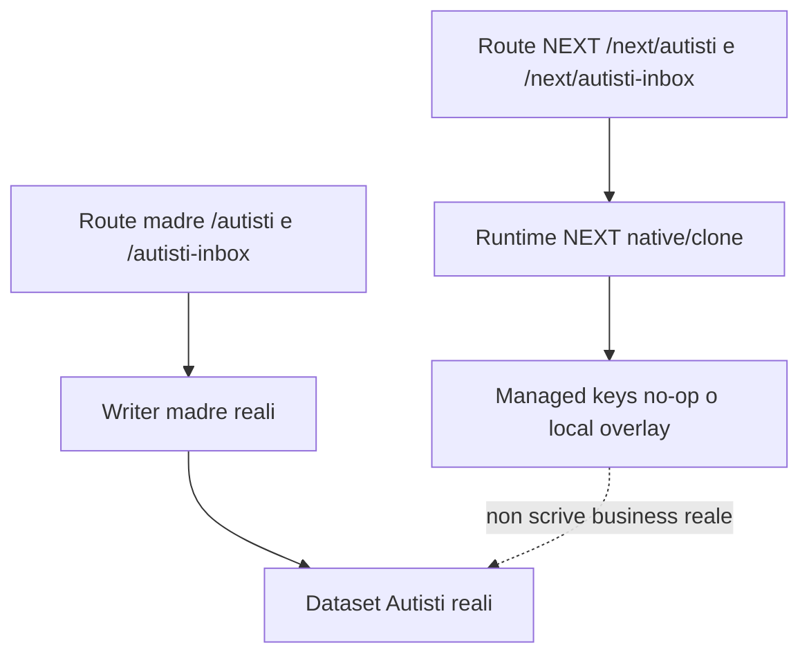

## 2. App Autisti NEXT - sessione, setup, cambio mezzo

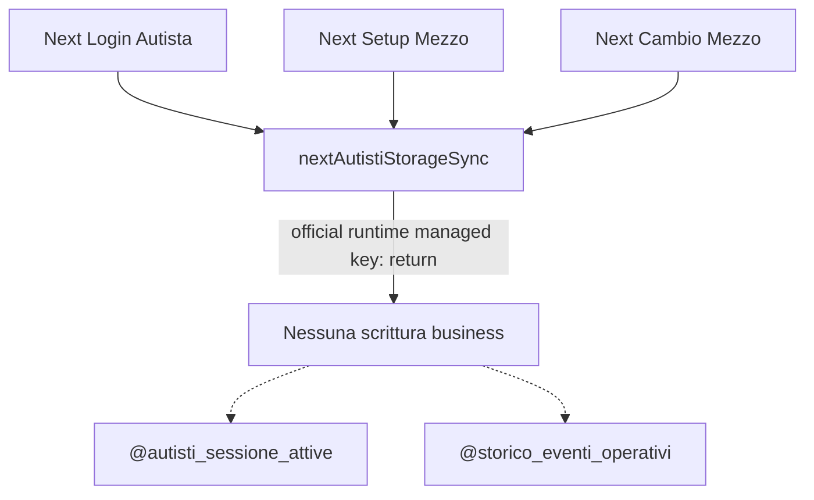

## 3. App Autisti NEXT - controllo, rifornimento, segnalazione, richiesta

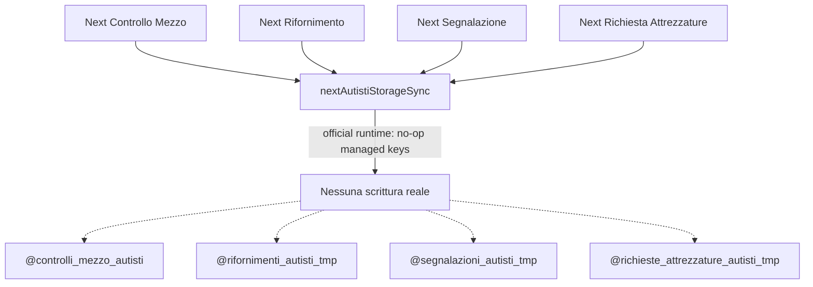

## 4. Autisti Inbox/Admin NEXT - lettura tmp e consolidamento

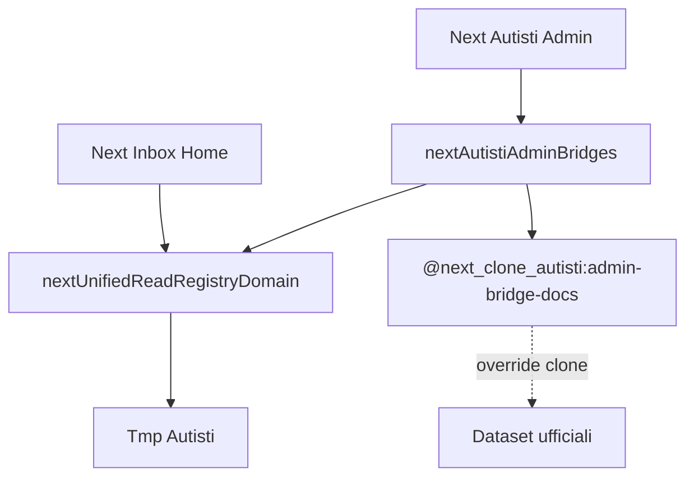

## 5. Rifornimenti autisti - tmp -> admin -> @rifornimenti

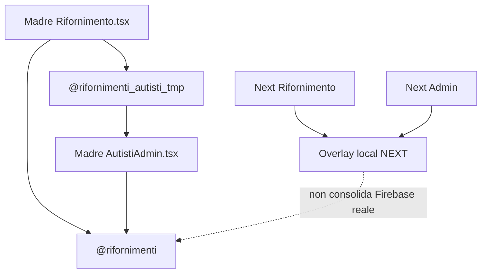

## 6. Controlli autisti - tmp -> inbox/admin -> Centro Controllo

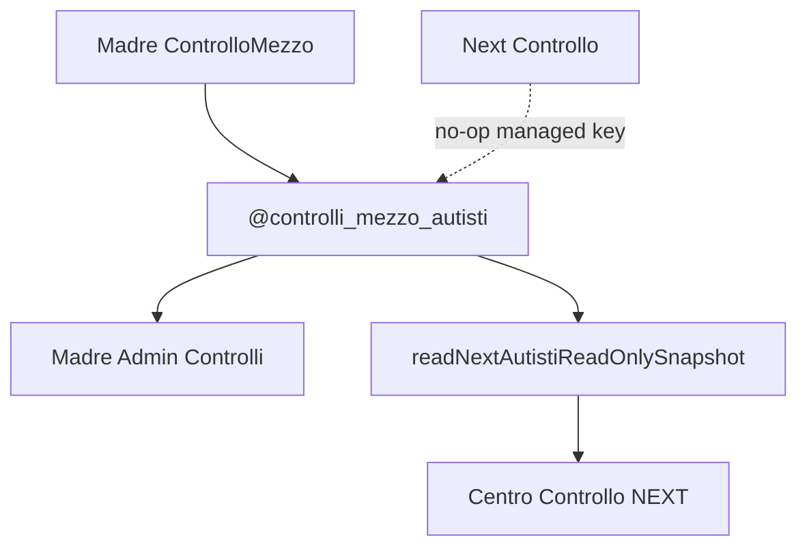

## 7. Segnalazioni autisti - tmp -> inbox/admin -> Dettaglio lavoro / Centro

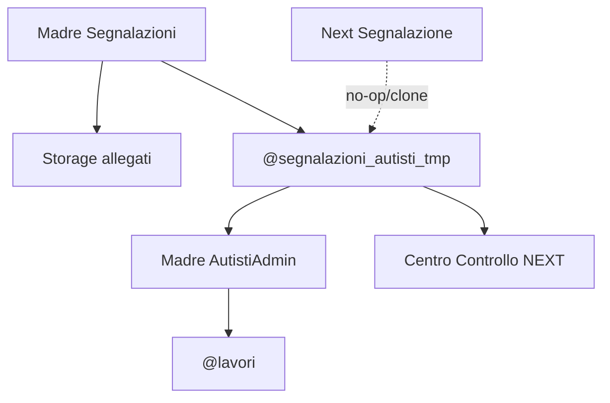

## 8. Gomme autisti - tmp -> admin -> @gomme_eventi -> Dossier gomme

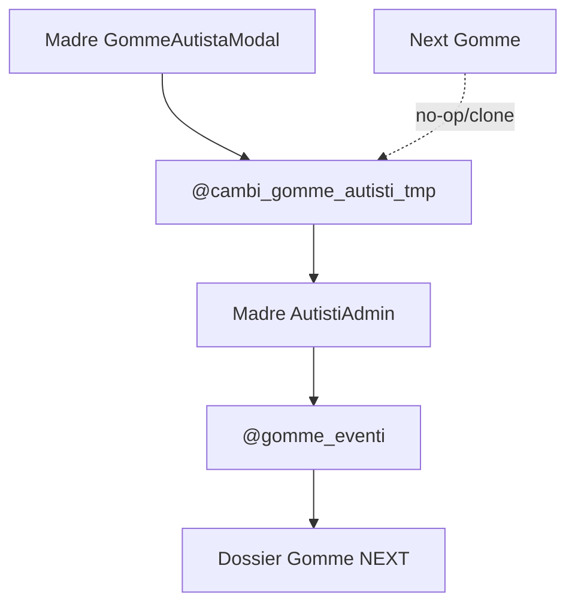

## 9. Richieste attrezzature - tmp -> inbox/admin -> Magazzino/Attrezzature

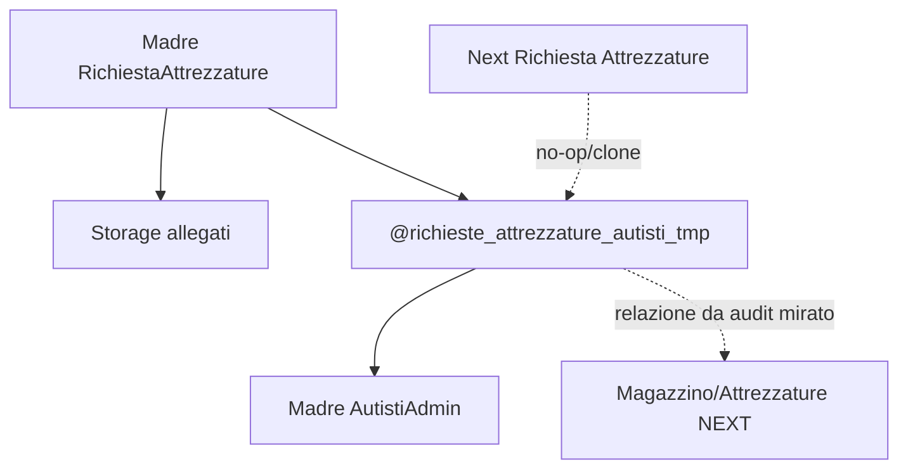

## 10. Archivista / IA documentale - documento -> Storage -> root collection -> moduli

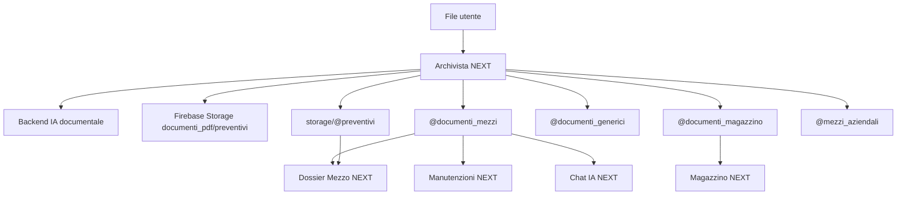

## 11. Punti DA VERIFICARE rimasti - diagramma di rischio

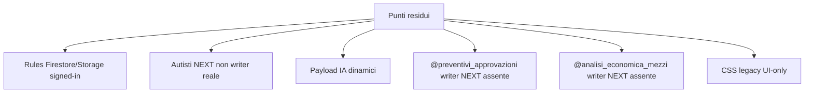

## 12. Dataset critici Autisti e Archivista - chi legge / chi scrive

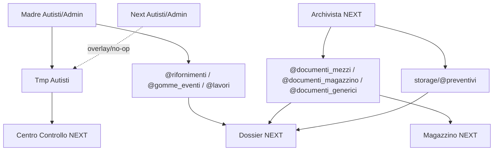
