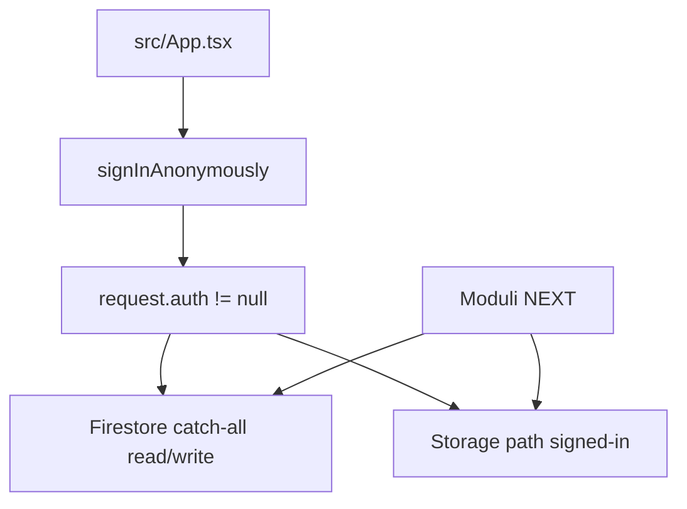
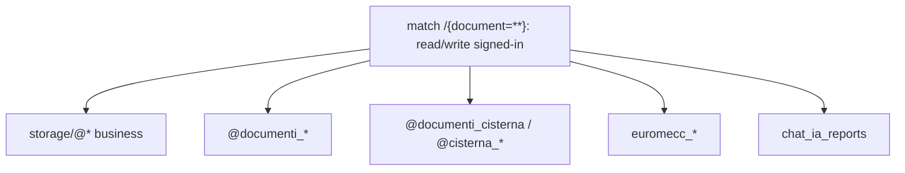
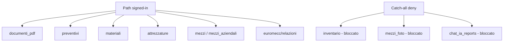
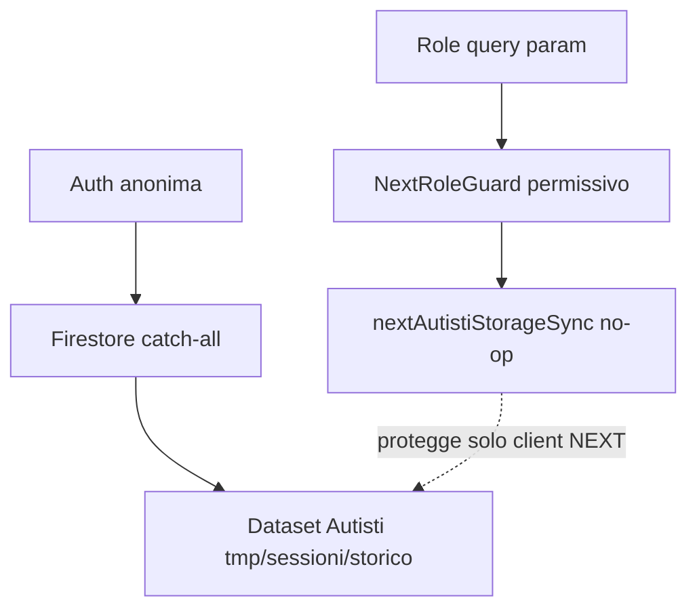
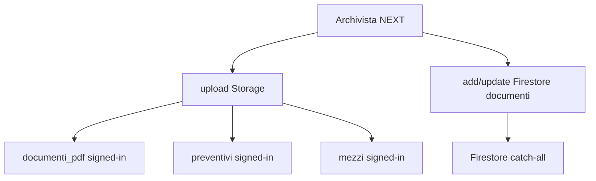
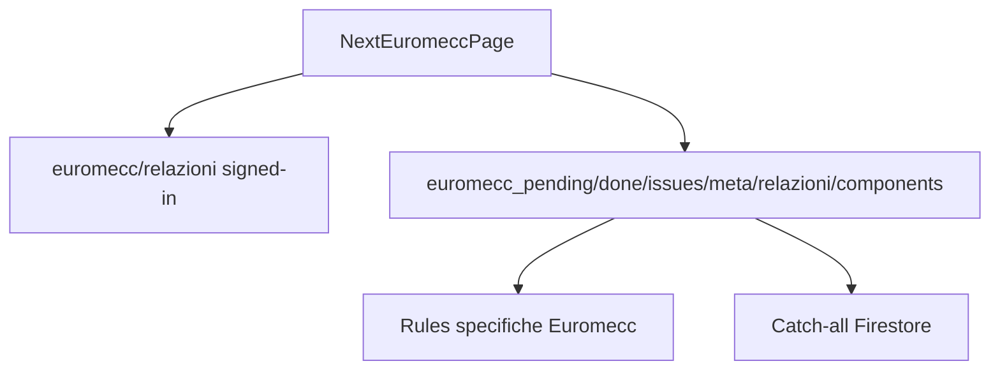
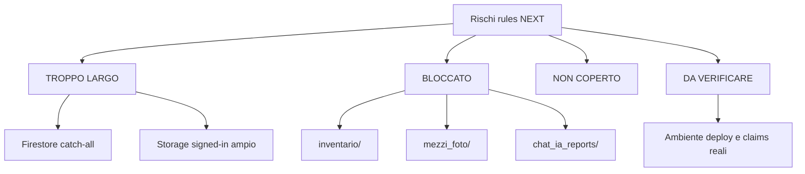

# Audit Firestore / Storage rules NEXT

Data originale: 2026-05-07 — Aggiornato: 2026-05-16

## Aggiornamento 2026-05-16

Delta dal 2026-05-08 al 2026-05-16 lato sicurezza scritture / scope barrier. Origine: `DIARIO_DECISIONI.md` + `AUDIT_NEXT_COMPLETO_2026-05-16.md` cap. 9 oss. 3.

**Nota su Firestore/Storage rules effettive**: VERIFICA NON ESEGUITA in questo turno su `firestore.rules` e `storage.rules` reali. Le sezioni 4, 5, 7, 10 dell'audit originale restano la fotografia disponibile (catch-all signed-in + Storage paths ampi/bloccanti). Se le rules non sono cambiate dopo il 2026-05-07 (non risultano interventi su `firestore.rules`/`storage.rules` in `DIARIO_DECISIONI`), la fotografia resta valida. Per ogni futuro lavoro su rules: ri-leggere i file effettivi prima di patchare.

**Scope barrier aggiunti dopo il 2026-05-07** (mitigazione client-side a `cloneWriteBarrier.ts`, NON server-side rules):

- `[NUOVO]` 4 nuovi scope barrier "Centro Controllo torre operativa" (decisione 2026-05-09): `RIFORNIMENTI_WRITE_SCOPE` (`centro_controllo_rifornimenti_write`), `SEGNALAZIONI_WRITE_SCOPE` (`centro_controllo_segnalazioni_write`), `CONTROLLI_WRITE_SCOPE` (`centro_controllo_controlli_write`), `RICHIESTE_WRITE_SCOPE` (`centro_controllo_richieste_write`). Path autorizzato unico `/next/centro-controllo`. Storage key whitelist 1-per-1 per ciascuno scope. Vedi [src/utils/cloneWriteBarrier.ts:111-148](../../../src/utils/cloneWriteBarrier.ts#L111-L148).
- `[NUOVO]` `DELETE_MEZZO_WRITE_SCOPE` (`centro_controllo_delete_mezzo_write`) — hard-delete mezzo cascade su 11 storage keys (`@mezzi_aziendali`, `@rifornimenti`, `@rifornimenti_autisti_tmp`, `@manutenzioni`, `@segnalazioni_autisti_tmp`, `@controlli_mezzo_autisti`, `@richieste_attrezzature_autisti_tmp`, `@cambi_gomme_autisti_tmp`, `@gomme_eventi`, `@autisti_sessione_attive`). Gesto nascosto shift+click foto + modale conferma con scrittura targa esatta. Decisione 2026-05-09. Vedi [src/utils/cloneWriteBarrier.ts:124-137](../../../src/utils/cloneWriteBarrier.ts#L124-L137).
- `[NUOVO]` `MANUTENZIONE_DAFARE_CREATE_WRITE_SCOPE` (`centro_controllo_manutenzione_dafare_create_write`) — path autorizzati `/next/centro-controllo`, `/next/autisti-admin`, `/next/autisti-inbox`. Storage keys `@manutenzioni`, `@segnalazioni_autisti_tmp`, `@controlli_mezzo_autisti`. Writer: `createManutenzioneDaFareFromEvento/Segnalazione/Controllo`. Vedi [src/utils/cloneWriteBarrier.ts:138-149](../../../src/utils/cloneWriteBarrier.ts#L138-L149).
- `[NUOVO]` `CHIUSURA_DA_EVENTO_WRITE_SCOPE` (`next_chiusura_da_evento_write_scope`) — path autorizzati `/next/manutenzioni`, `/next/autisti-inbox`, `/next/centro-controllo`. Storage keys `@manutenzioni`, `@segnalazioni_autisti_tmp`, `@controlli_mezzo_autisti`. Writer: macchina chiusura ciclo eventi 2026-05-14. Vedi [src/utils/cloneWriteBarrier.ts:150-160](../../../src/utils/cloneWriteBarrier.ts#L150-L160).
- `[NUOVO]` `CENTRO_CONTROLLO_LEGAME_WRITE_SCOPE` (`centro_controllo_legame_write`) — PROMPT 47/48 aggancio inverso (2026-05-15). Path autorizzato `/next/centro-controllo`. Storage keys `@manutenzioni`, `@segnalazioni_autisti_tmp`, `@controlli_mezzo_autisti`. Writer: `agganciaSegnalazioneAManutenzioneEsistente`, `sganciaLegameOrfano`, `segnaPresaInCaricoSegnalazione`. Vedi [src/utils/cloneWriteBarrier.ts:161-172](../../../src/utils/cloneWriteBarrier.ts#L161-L172).
- `[NUOVO]` `ARCHIVIO_HIDE_WRITE_SCOPE` (`centro_controllo_archivio_hide_write`) — PROMPT 31.1 (2026-05-12), soft-hide `nascostoInArchivio` su 4 collezioni Archivio Storico. Path autorizzato `/next/centro-controllo`. Writer enforce singolarità del campo applicativamente. Vedi [src/utils/cloneWriteBarrier.ts:173-184](../../../src/utils/cloneWriteBarrier.ts#L173-L184).

**Conseguenza sulla matrice "Moduli NEXT - rules" (sez. 6)**:

- `[AGGIORNATO]` Centro Controllo NEXT, Autisti Admin/Inbox NEXT, Manutenzioni NEXT — la riga "TROPPO LARGO" sui catch-all rules **resta vera lato server-side** (Firestore rules non sono cambiate). Lato client-side, il barrier ha aggiunto 6 nuove deroghe scope (sopra) che restringono le scritture NEXT effettive a perimetri narrow. Esempio: `markSegnalazioneChiusa` funziona SOLO da `/next/centro-controllo` con scope `SEGNALAZIONI_WRITE_SCOPE`. Lo stesso writer chiamato da altre rotte è bloccato da `CloneWriteBlockedError`.
- `[AGGIORNATO]` Sicurezza scritture NEXT — il file `cloneWriteBarrier.ts` è ora a **~985 righe con 15+ scope** (citato in `AUDIT_NEXT_COMPLETO_2026-05-16.md` cap. 9 oss. 3 come debito di leggibilità crescente). Pattern solido ma scalabilità manuale.

**Conseguenza sui rischi (sez. 12 originale)**:

- `[AGGIORNATO]` R-CRIT-01 Catch-all Firestore — **invariato come stato server-side**, mitigato client-side dai 15+ scope barrier.
- `[AGGIORNATO]` R-CRIT-04 "Dataset Autisti scrivibili da signed-in" — invariato server-side. Client-side: i writer NEXT Autisti business (`markSegnalazioneChiusa`/`markControlloChiuso`/`markRichiestaEvasa`/hard-delete) sono ora gated da scope barrier su `/next/centro-controllo`.
- `[NUOVO]` Decisioni 2026-05-04 post-audit copertura modali — 7 punti decisi, 3-4 ancora APERTI a 2026-05-16 (rilevanti per rules/registro): punto 1 (root collection documentali `@documenti_*` vs `storage/@documenti_*` registro), punto 2 (Cisterna nel motore generico v1: `@documenti_cisterna`/`@cisterna_schede_ia`/`@cisterna_parametri_mensili` non nel registro), punto 4 (foto storage path in allowedFields), punto 7 (coordinate hotspot `x/y/areaId/uploadedAt`).

Natura: audit sola lettura su rules, config Firebase e impatto sui moduli NEXT. Nessuna modifica runtime, nessuna modifica rules, nessun deploy.

## 1. Executive summary

Esito Firestore rules: TROPPO LARGHE.

Motivo dimostrato: `firestore.rules` contiene match specifici Euromecc con validazioni, ma contiene anche il catch-all `match /{document=**}` con `allow read, write: if isSignedIn()` (`firestore.rules:235-236`). Poiche' l'app esegue login anonimo all'avvio (`src/App.tsx:156-160`), ogni utente autenticato anonimo puo' leggere e scrivere qualsiasi documento Firestore coperto dal progetto, salvo controlli applicativi lato client o barrier NEXT.

Esito Storage rules: TROPPO LARGHE e BLOCCANTI.

Motivo dimostrato: `storage.rules` consente `read, write` a `request.auth != null` su path business/documentali ampi (`storage.rules:8-30`), senza validazione size/contentType. Allo stesso tempo path usati dalla NEXT come `inventario/`, `mezzi_foto/` e `chat_ia_reports/` non sono coperti e cadono nel deny finale (`storage.rules:32-33`).

Conclusione: le rules attuali non sono coerenti con una NEXT multi-modulo con auth anonima e ruoli simulati lato frontend. Firestore non blocca flussi perche' e' troppo largo; Storage blocca alcuni upload NEXT reali e lascia troppo larghi altri path.

## 2. Metodo e fonti

Fonti lette:

- `firebase.json`
- `.firebaserc`
- `firestore.rules`
- `storage.rules`
- `src/firebase.ts`
- `src/App.tsx`
- `src/next/NextRoleGuard.tsx`
- `src/next/nextAccess.ts`
- `src/utils/cloneWriteBarrier.ts`
- `src/utils/storageSync.ts`
- `src/utils/firestoreWriteOps.ts`
- `src/utils/storageWriteOps.ts`
- `src/next/**` mirato su writer/readers e Storage path
- `backend/internal-ai/**` mirato su firebase-admin/readiness/boundary
- `functions/**`, `functions-schede/**` mirati su admin SDK e onRequest
- `docs/_live/security/SICUREZZA_E_PERMESSI.md`
- report `01`..`07` nella cartella audit

Stati usati: `DIMOSTRATO`, `DOCUMENTATO`, `DEDOTTO`, `DA VERIFICARE`, `NON PRESENTE`, `NON LETTO`.

## 3. Firebase config

| Aspetto | Valore | Fonte | Stato |
|---|---|---|---|
| Progetto Firebase default | `gestionemanutenzione-934ef` | `.firebaserc` | DIMOSTRATO |
| ProjectId frontend | `gestionemanutenzione-934ef` | `src/firebase.ts:14` | DIMOSTRATO |
| Auth domain | `gestionemanutenzione-934ef.firebaseapp.com` | `src/firebase.ts:12` | DIMOSTRATO |
| Storage bucket frontend | `gestionemanutenzione-934ef.firebasestorage.app` | `src/firebase.ts:15`, `:27` | DIMOSTRATO |
| Firestore client | `getFirestore(app)` | `src/firebase.ts:23-24` | DIMOSTRATO |
| Storage client | `getStorage(app, firebaseConfig.storageBucket)` | `src/firebase.ts:26-27` | DIMOSTRATO |
| Functions client | `getFunctions(app)` senza regione esplicita | `src/firebase.ts:29-30` | DIMOSTRATO |
| Auth client | `getAuth(app)` | `src/firebase.ts:31-32` | DIMOSTRATO |
| Login anonimo frontend | se `!user`, `signInAnonymously(auth)` | `src/App.tsx:156-160` | DIMOSTRATO |
| Role NEXT | query param `role`, default `admin` | `src/next/nextAccess.ts:46-48`, `:199-210` | DIMOSTRATO |
| Guard NEXT | permissivo, ritorna sempre children; in DEV logga warning | `src/next/NextRoleGuard.tsx:15-32` | DIMOSTRATO |
| Rules Firestore dichiarate | `firestore.rules` | `firebase.json` | DIMOSTRATO |
| Rules Storage dichiarate | `storage.rules` | `firebase.json` | DIMOSTRATO |
| Functions codebase default | source `functions`, codebase `default` | `firebase.json` | DIMOSTRATO |
| Functions codebase schede | source `functions-schede`, codebase `schede` | `firebase.json` | DIMOSTRATO |
| Hosting | non dichiarato in `firebase.json` | `firebase.json` | NON PRESENTE |
| Emulatori | non dichiarati in `firebase.json` | `firebase.json` | NON PRESENTE |
| Regione functions v1 default | non esplicita nei file letti | `functions/index.js:6`, `:690`, `:794` | DA VERIFICARE |
| Functions v2 schede | `onRequest` con timeout/memory/cors, regione non esplicita | `functions-schede/index.js:1-12` | DIMOSTRATO |
| Backend internal-ai | server separato con `firebase-admin` read-only se credenziali pronte | `backend/internal-ai/server/internal-ai-firebase-admin.js`; `backend/internal-ai/README.md:45-102` | DIMOSTRATO |

Nota: `docs/_live/security/SICUREZZA_E_PERMESSI.md:16-17` e' storico/stale rispetto al repo corrente: dichiara Storage tutto bloccato e Firestore rules assenti, ma oggi `storage.rules` e `firestore.rules` esistono e sono letti in questo audit.

## 4. Firestore rules - mappa completa

| Path rule | Read | Create | Update | Delete | Condizione | Dataset NEXT collegati | Rischio | Fonte |
|---|---|---|---|---|---|---|---|---|
| `/euromecc_pending/{taskId}` | si | si | no specifico | si | signed-in + `isValidPendingData` per create | Euromecc pending | CRITICO per catch-all che permette comunque write generico | `firestore.rules:195-199`, `:235-236` |
| `/euromecc_done/{taskId}` | si | si | no specifico | no specifico | signed-in + `isValidDoneData` per create | Euromecc done | CRITICO per catch-all che permette update/delete | `firestore.rules:201-204`, `:235-236` |
| `/euromecc_issues/{issueId}` | si | si | si solo close valido | no specifico | signed-in + shape issue/close | Euromecc issues | CRITICO per catch-all che permette altre update/delete | `firestore.rules:206-212`, `:235-236` |
| `/euromecc_area_meta/{areaKey}` | si | si | si | no specifico | signed-in + `isValidAreaMetaData` | Euromecc area meta | CRITICO per catch-all che permette delete e bypass shape | `firestore.rules:214-217`, `:235-236` |
| `/euromecc_extra_components/{docId}` | si | si | no specifico | si | signed-in + campi string minimi per create | Euromecc extra components | CRITICO per catch-all che permette update e bypass shape | `firestore.rules:219-226`, `:235-236` |
| `/euromecc_relazioni/{docId}` | si | si | si | si | signed-in, nessuna shape validation | Euromecc relazioni/allegati | ALTO | `firestore.rules:229-232` |
| `/{document=**}` | si | write totale | write totale | write totale | signed-in | tutti i dataset Firestore, inclusi `storage/*`, documenti, Chat IA, Cisterna, Dossier, Autisti | CRITICO | `firestore.rules:235-236` |

Osservazione chiave: il catch-all rende non efficaci come controllo di sicurezza le validazioni specifiche Euromecc, perche' le allow rule sono valutate in OR. Un write signed-in che non soddisfa la shape specifica puo' comunque essere autorizzato dal match generico.

## 5. Storage rules - mappa completa

| Storage path rule | Read | Write | Delete | Condizione | Moduli NEXT collegati | Rischio | Fonte |
|---|---|---|---|---|---|---|---|
| `euromecc/relazioni/{relazioneId}/{fileName}` | si | si | si come write | `request.auth != null` | Euromecc upload relazione | ALTO: no size/contentType | `storage.rules:8-10`; `NextEuromeccPage.tsx:3169-3174` |
| `documenti_pdf/{allPaths=**}` | si | si | si come write | `request.auth != null` | Archivista, Cisterna documenti/schede | ALTO: documenti e allegati ampi | `storage.rules:11-13`; `ArchivistaArchiveClient.ts:213-215`, `:438-442`; `NextCisternaIAPage.tsx:275-281` |
| `mezzi_aziendali/{allPaths=**}` | si | si | si come write | `request.auth != null` | IA libretto preview mezzo | ALTO | `storage.rules:14-16`; `NextIALibrettoPage.tsx:423-427` |
| `libretto/{allPaths=**}` | si | si | si come write | `request.auth != null` | legacy/libretti, uso NEXT non confermato in questo audit | MEDIO | `storage.rules:17-19` |
| `mezzi/{allPaths=**}` | si | si | si come write | `request.auth != null` | foto mezzo da Archivista Documento Mezzo | ALTO | `storage.rules:20-22`; `ArchivistaDocumentoMezzoBridge.tsx:2809-2815` |
| `preventivi/{allPaths=**}` | si | si | si come write | `request.auth != null` | preventivi manuali/IA, Archivista preventivi | ALTO | `storage.rules:23-25`; `nextPreventivoManualeWriter.ts:206-244`; `ArchivistaArchiveClient.ts:213` |
| `materiali/{allPaths=**}` | si | si | si come write | `request.auth != null` | Materiali da ordinare, procurement | ALTO | `storage.rules:26-28`; `NextMaterialiDaOrdinarePage.tsx:990-1065` |
| `attrezzature/{allPaths=**}` | si | si | si come write | `request.auth != null` | Attrezzature cantieri | ALTO | `storage.rules:29-31`; `nextAttrezzatureCantieriWriter.ts:19`, `:246-263` |
| `{allPaths=**}` | no | no | no | `false` | path non coperti | BLOCCANTE per path NEXT non mappati | `storage.rules:32-33` |

Path NEXT usati ma non coperti da allow Storage:

| Path usato | Modulo | Rule applicata | Esito | Fonte |
|---|---|---|---|---|
| `inventario/{itemId}/foto.ext` | Magazzino NEXT | catch-all deny | BLOCCATO | `NextMagazzinoPage.tsx:810-818`; `storage.rules:32-33` |
| `mezzi_foto/{targa}/...` | Mappa storico mezzo | catch-all deny | BLOCCATO | `nextMappaStoricoDomain.ts:450-452`; `storage.rules:32-33` |
| `chat_ia_reports/{sector}/{year}/{id}.pdf` | Chat IA report archive | catch-all deny | BLOCCATO | `chatIaReportArchive.ts:8-9`, `:54-58`; `storage.rules:32-33` |

## 6. Matrice moduli NEXT - rules

| Modulo NEXT | Dataset/Storage usati | Operazione | Rule che copre | Esito | Rischio |
|---|---|---|---|---|---|
| Centro Controllo NEXT | `storage/@mezzi_aziendali`, `@rifornimenti`, tmp Autisti | read Firestore | catch-all `/{document=**}` | TROPPO LARGO | ALTO |
| Magazzino NEXT | `storage/@inventario`, `@materialiconsegnati`, `@cisterne_adblue`; Storage `inventario/` | read/write Firestore, upload Storage | Firestore catch-all; Storage deny per `inventario/` | TROPPO LARGO + BLOCCATO upload | CRITICO |
| Manutenzioni NEXT | `storage/@manutenzioni`, `@inventario`, `@materialiconsegnati`, `@mezzi_foto_viste`, `@mezzi_hotspot_mapping`; Storage `mezzi_foto/` | read/write Firestore, upload Storage | Firestore catch-all; Storage deny per `mezzi_foto/` | TROPPO LARGO + BLOCCATO upload | CRITICO |
| Procurement/Acquisti NEXT | `storage/@ordini`, `@preventivi`, `@listino_prezzi`; Storage `preventivi/`, `materiali/` | read/write/upload/delete | Firestore catch-all; Storage allow signed-in | TROPPO LARGO | CRITICO |
| Euromecc NEXT | Euromecc collections; `storage/@ordini`; Storage `euromecc/relazioni/` | read/create/update/delete/upload | specifiche Euromecc + catch-all; Storage signed-in | TROPPO LARGO | CRITICO |
| Dossier NEXT | `storage/@mezzi_aziendali`, documenti, `@costiMezzo`, `@analisi_economica_mezzi` | read, delete/update documenti/costi in alcune azioni | catch-all | TROPPO LARGO | CRITICO |
| Autisti NEXT | tmp/sessioni/storico/mezzi/colleghi | read; writer business no-op/overlay NEXT | catch-all se writer reale venisse usato | TROPPO LARGO | CRITICO |
| Autisti Inbox/Admin NEXT | tmp autisti, `@rifornimenti`, `@gomme_eventi`; delete allegati tramite bridge locale | overlay locale; read registry | Firestore catch-all per letture reali | TROPPO LARGO | ALTO |
| Archivista/IA documentale NEXT | `@documenti_mezzi`, `@documenti_magazzino`, `storage/@preventivi`, `@mezzi_aziendali`; Storage `documenti_pdf/`, `preventivi/`, `mezzi/` | create/update/set/upload | catch-all; Storage signed-in | TROPPO LARGO | CRITICO |
| Cisterna NEXT | `@documenti_cisterna`, `@cisterna_schede_ia`, `@cisterna_parametri_mensili`; Storage `documenti_pdf/cisterna*` | read/create/update/upload | catch-all; Storage `documenti_pdf` | TROPPO LARGO | CRITICO |
| Scadenze/Collaudi NEXT | `storage/@mezzi_aziendali` | read/write via `setItemSync` scoped | catch-all | TROPPO LARGO | ALTO |
| Anagrafiche NEXT | `storage/@colleghi`, `@fornitori`, `@officine` | read/write via `setDoc` | catch-all | TROPPO LARGO | ALTO |
| Attrezzature cantieri NEXT | `storage/@attrezzature_cantieri`; Storage `attrezzature/` | read/write/upload/delete | catch-all; Storage signed-in | TROPPO LARGO | ALTO |
| Capo NEXT | `storage/@preventivi_approvazioni`, `@costiMezzo`, `@analisi_economica_mezzi` | read, writer approvazioni non dimostrato in NEXT | catch-all | TROPPO LARGO | CRITICO |
| Chat IA NEXT | backend tool-use; `chat_ia_reports`; Storage `chat_ia_reports/` se archivia PDF | backend read-only per chat, frontend archive Firestore/Storage | Firestore catch-all; Storage deny per `chat_ia_reports/` | TROPPO LARGO + BLOCCATO upload | ALTO |

## 7. Dataset critici - rules

| Dataset | Criticita dati | Rule applicata | Read | Write | Validazione | Esito | Rischio |
|---|---|---|---|---|---|---|---|
| `storage/@mezzi_aziendali` | master flotta | catch-all | si | si | no | TROPPO LARGO | CRITICO |
| `storage/@inventario` | stock/materiali | catch-all | si | si | no | TROPPO LARGO | CRITICO |
| `storage/@materialiconsegnati` | movimenti materiali | catch-all | si | si | no | TROPPO LARGO | CRITICO |
| `storage/@manutenzioni` | storico manutenzioni | catch-all | si | si | no | TROPPO LARGO | CRITICO |
| `storage/@lavori` | stato operativo lavori | catch-all | si | si | no | TROPPO LARGO | CRITICO |
| `storage/@ordini` | ordini/acquisti | catch-all | si | si | no | TROPPO LARGO | CRITICO |
| `storage/@preventivi` | documenti economici | catch-all | si | si | no | TROPPO LARGO | CRITICO |
| `storage/@listino_prezzi` | prezzi/listino | catch-all | si | si | no | TROPPO LARGO | CRITICO |
| `storage/@colleghi` | persone/autisti | catch-all | si | si | no | TROPPO LARGO | CRITICO |
| `storage/@fornitori` | anagrafica fornitori | catch-all | si | si | no | TROPPO LARGO | ALTO |
| `storage/@officine` | officine | catch-all | si | si | no | TROPPO LARGO | ALTO |
| `storage/@rifornimenti` | rifornimenti ufficiali | catch-all | si | si | no | TROPPO LARGO | CRITICO |
| `storage/@rifornimenti_autisti_tmp` | tmp rifornimenti autisti | catch-all | si | si | no | TROPPO LARGO | CRITICO |
| `storage/@autisti_sessione_attive` | sessioni autisti | catch-all | si | si | no | TROPPO LARGO | CRITICO |
| `storage/@storico_eventi_operativi` | log operativo | catch-all | si | si | no | TROPPO LARGO | CRITICO |
| `storage/@segnalazioni_autisti_tmp` | segnalazioni tmp | catch-all | si | si | no | TROPPO LARGO | CRITICO |
| `storage/@controlli_mezzo_autisti` | controlli autisti | catch-all | si | si | no | TROPPO LARGO | CRITICO |
| `storage/@richieste_attrezzature_autisti_tmp` | richieste autisti | catch-all | si | si | no | TROPPO LARGO | ALTO |
| `storage/@cambi_gomme_autisti_tmp` | tmp gomme | catch-all | si | si | no | TROPPO LARGO | ALTO |
| `storage/@gomme_eventi` | storico gomme ufficiale | catch-all | si | si | no | TROPPO LARGO | ALTO |
| `@documenti_mezzi` | documenti mezzi | catch-all | si | si | no | TROPPO LARGO | CRITICO |
| `@documenti_magazzino` | documenti magazzino | catch-all | si | si | no | TROPPO LARGO | CRITICO |
| `@documenti_generici` | documenti generici | catch-all | si | si | no | TROPPO LARGO | ALTO |
| `@documenti_cisterna` | documenti cisterna | catch-all | si | si | no | TROPPO LARGO | CRITICO |
| `@cisterna_schede_ia` | schede cisterna IA | catch-all | si | si | no | TROPPO LARGO | CRITICO |
| `@cisterna_parametri_mensili` | parametri mensili | catch-all | si | si | no | TROPPO LARGO | ALTO |
| `euromecc_pending` | task Euromecc | specifica + catch-all | si | si | bypassabile | TROPPO LARGO | CRITICO |
| `euromecc_done` | storico done | specifica + catch-all | si | si | bypassabile | TROPPO LARGO | CRITICO |
| `euromecc_issues` | anomalie | specifica + catch-all | si | si | bypassabile | TROPPO LARGO | CRITICO |
| `euromecc_area_meta` | metadati area | specifica + catch-all | si | si | bypassabile | TROPPO LARGO | ALTO |
| `euromecc_relazioni` | relazioni/allegati | specifica senza shape + catch-all | si | si | no | TROPPO LARGO | ALTO |
| `euromecc_extra_components` | componenti extra | specifica + catch-all | si | si | bypassabile | TROPPO LARGO | ALTO |

Dataset critici verificati: 32.

## 8. Autisti / auth / sessioni

| Area Autisti | Dataset | Rule | Rischio | Fonte |
|---|---|---|---|---|
| Auth frontend | tutti i dataset | login anonimo crea `request.auth != null` | CRITICO: auth anonima soddisfa catch-all | `src/App.tsx:156-160`; `firestore.rules:5-7`, `:235-236` |
| Ruoli NEXT | tutti i moduli NEXT | role via query param, guard permissivo | ALTO: non e' controllo security server-side | `nextAccess.ts:46-48`, `:207-210`; `NextRoleGuard.tsx:21-32` |
| Sessioni autisti | `storage/@autisti_sessione_attive` | catch-all | CRITICO | `05_AUDIT...`; `firestore.rules:235-236` |
| Storico eventi | `storage/@storico_eventi_operativi` | catch-all | CRITICO | `05_AUDIT...`; `firestore.rules:235-236` |
| Tmp controlli/segnalazioni/richieste/gomme/rifornimenti | storage document vari | catch-all | CRITICO | `05_AUDIT...`; `firestore.rules:235-236` |
| Consolidamento admin | `storage/@rifornimenti`, `@gomme_eventi`, `@lavori` | catch-all | CRITICO se writer reale abilitato | `05_AUDIT...`; `firestore.rules:235-236` |
| NEXT official runtime | managed keys no-op/overlay | barrier applicativa, non rule server-side | MEDIO: riduce rischio client NEXT ma non sostituisce rules | `nextAutistiStorageSync.ts:11-19`, `:116-118`; `nextAutistiAdminBridges.ts:111-124` |

Conclusione Autisti: lato rules, qualunque utente autenticato puo' scrivere dataset Autisti. L'attuale protezione della NEXT dipende dal client (`cloneWriteBarrier`, `nextAutistiStorageSync`) e non dalle rules.

## 9. Archivista / IA documentale / Storage

| Ramo IA documentale | Firestore dataset | Storage path | Rule Firestore | Rule Storage | Rischio |
|---|---|---|---|---|---|
| Archivista documenti mezzi | `@documenti_mezzi` | `documenti_pdf/...`, eventuale `mezzi/...` | catch-all read/write | signed-in read/write | CRITICO |
| Archivista documenti magazzino | `@documenti_magazzino` | `documenti_pdf/...` | catch-all read/write | signed-in read/write | CRITICO |
| Archivista preventivi | `storage/@preventivi` | `preventivi/...` | catch-all read/write | signed-in read/write | CRITICO |
| IA Libretto | `storage/@mezzi_aziendali` | `mezzi_aziendali/{id}/libretto.jpg` | catch-all read/write | signed-in read/write | CRITICO |
| IA Documenti gestione costi | `@documenti_mezzi`, `@documenti_magazzino`, `@documenti_generici`, `storage/@costiMezzo` | lettura Storage da URL/path | catch-all read/write | dipende dal path | CRITICO |
| Cisterna IA | `@documenti_cisterna` | `documenti_pdf/cisterna/...` | catch-all read/write | signed-in read/write su `documenti_pdf` | CRITICO |
| Cisterna schede IA | `@cisterna_schede_ia` | `documenti_pdf/cisterna_schede/...` | catch-all read/write | signed-in read/write su `documenti_pdf` | CRITICO |

Fonti: `ArchivistaArchiveClient.ts:213-215`, `:438-442`, `:461-506`, `:530-603`; `ArchivistaDocumentoMezzoBridge.tsx:2809-2815`; `NextIALibrettoPage.tsx:423-427`, `:465`; `NextCisternaIAPage.tsx:275-281`, `:330-366`; `nextCisternaWriter.ts:62-95`.

## 10. Euromecc rules

| Collection/path | Read | Write/Delete | Validazione | Coerenza con writer NEXT | Rischio | Fonte |
|---|---|---|---|---|---|---|
| `euromecc_pending` | signed-in | create/delete specifici + catch-all generale | create shape valida ma bypassabile | writer domain fa add/delete/update | CRITICO | `firestore.rules:195-199`; `nextEuromeccDomain.ts:460`, `:476`, `:483` |
| `euromecc_done` | signed-in | create specifico + catch-all update/delete | create shape valida ma bypassabile | domain fa add/update/delete | CRITICO | `firestore.rules:201-204`; `nextEuromeccDomain.ts:514`, `:538`, `:553` |
| `euromecc_issues` | signed-in | create/update close specifici + catch-all | shape/close bypassabili | domain fa add/update/delete | CRITICO | `firestore.rules:206-212`; `nextEuromeccDomain.ts:559`, `:587`, `:604`, `:613` |
| `euromecc_area_meta` | signed-in | create/update specifici + catch-all delete | shape bypassabile | domain setDoc | ALTO | `firestore.rules:214-217`; `nextEuromeccDomain.ts:627-628` |
| `euromecc_extra_components` | signed-in | create/delete specifici + catch-all update | shape minima bypassabile | page addDoc | ALTO | `firestore.rules:219-226`; `NextEuromeccPage.tsx:3116` |
| `euromecc_relazioni` | signed-in | create/update/delete signed-in | no shape validation | page addDoc | ALTO | `firestore.rules:229-232`; `NextEuromeccPage.tsx:2980`, `:3033`, `:3181` |
| `euromecc/relazioni/...` Storage | signed-in | write signed-in | no size/contentType | page uploadBytes | ALTO | `storage.rules:8-10`; `NextEuromeccPage.tsx:3169-3174` |

## 11. Diagrammi Mermaid

### 11.1 Accesso Firebase generale NEXT

### 11.2 Firestore rules -> dataset critici

### 11.3 Storage rules -> path usati dalla NEXT

### 11.4 Autisti auth/session/rules

### 11.5 Archivista / Storage / rules

### 11.6 Euromecc / rules

### 11.7 Rischi

## 12. Rischi classificati

### CRITICO

| Codice | Descrizione | Rule coinvolta | Dataset/path | Moduli NEXT impattati | Motivo | Mitigazione concettuale |
|---|---|---|---|---|---|---|
| R-CRIT-01 | Catch-all Firestore read/write per signed-in | `/{document=**}` | tutti i dataset Firestore | tutti | con login anonimo ogni client autenticato soddisfa la rule | separare read/write per dataset critici e introdurre validazione shape/ruoli server-side |
| R-CRIT-02 | Validazioni Euromecc bypassabili dal catch-all | specifiche Euromecc + catch-all | `euromecc_*` | Euromecc | le allow specifiche non sono controllo effettivo se catch-all autorizza | rimuovere sovrapposizione generica e mantenere validazioni per collection |
| R-CRIT-03 | Dataset economici e ordini scrivibili da signed-in | catch-all | `@preventivi`, `@listino_prezzi`, `@ordini`, `@costiMezzo` | Procurement, Capo, Dossier, Archivista | dati economici senza gating server-side | isolare permessi economici e validare payload |
| R-CRIT-04 | Dataset Autisti scrivibili da signed-in | catch-all | sessioni/tmp/storico/rifornimenti | Autisti, Centro, Dossier | dati operativi/autista sensibili | separare area autisti/admin con permessi reali |
| R-CRIT-05 | Documenti e mezzi scrivibili da signed-in | catch-all | `@documenti_*`, `@mezzi_aziendali` | Archivista, Dossier, IA | documenti e master flotta esposti a write largo | validare per collection e ruolo |

### ALTO

| Codice | Descrizione | Rule coinvolta | Dataset/path | Moduli NEXT impattati | Motivo | Mitigazione concettuale |
|---|---|---|---|---|---|---|
| R-ALTO-01 | Storage documentale ampio | `documenti_pdf/**` | documenti IA/Cisterna | Archivista, Cisterna | nessuna size/contentType/path validation | distinguere sottopath e tipo file ammesso |
| R-ALTO-02 | Storage preventivi/materiali/attrezzature ampio | `preventivi/**`, `materiali/**`, `attrezzature/**` | allegati business | Procurement, Magazzino, Attrezzature | upload/delete larghi per signed-in | limitare write per modulo e metadata |
| R-ALTO-03 | Storage path NEXT bloccati | catch-all deny | `inventario/`, `mezzi_foto/`, `chat_ia_reports/` | Magazzino, Mappa storico, Chat IA | flussi NEXT dichiarati possono fallire | allineare path effettivi e policy |
| R-ALTO-04 | Ruoli NEXT solo frontend | `NextRoleGuard` | tutti i moduli | NEXT shell | query param/guard non applica blocco server-side | spostare autorizzazione dati su rules/claims |

### MEDIO

| Codice | Descrizione | Rule coinvolta | Dataset/path | Moduli NEXT impattati | Motivo | Mitigazione concettuale |
|---|---|---|---|---|---|---|
| R-MED-01 | Documentazione sicurezza live non allineata alle rules correnti | docs security | Storage/Firestore | governance | documento dice Storage deny totale e Firestore assente | aggiornare documentazione dopo audit mirato futuro |
| R-MED-02 | Functions onRequest con CORS aperto da verificare rispetto ad auth | functions HTTP | function endpoints | IA/Libretto/Cisterna | rules Firestore/Storage non governano admin SDK | audit separato function-level auth |

### BASSO

| Codice | Descrizione | Rule coinvolta | Dataset/path | Moduli NEXT impattati | Motivo | Mitigazione concettuale |
|---|---|---|---|---|---|---|
| R-BASSO-01 | `libretto/**` presente ma uso NEXT non confermato | Storage `libretto/**` | libretti legacy | IA/libretti | non e' il path principale NEXT letto | verificare uso prima di cambiare |

## 13. Punti DA VERIFICARE

| Punto | Stato | Fonte |
|---|---|---|
| Deploy corrente usa effettivamente queste rules | DA VERIFICARE | repo locale contiene rules; nessun deploy verificato |
| Claims/ruoli Firebase reali | NON PRESENTE nel codice letto | `firestore.rules` non usa claims; frontend usa query param |
| Auth provider diversi da anonymous in produzione | DA VERIFICARE | `src/App.tsx:156-160` dimostra anonymous fallback |
| Function-level authorization | DA VERIFICARE | functions usano admin SDK e CORS; audit auth function non completato |
| Path `libretto/**` uso NEXT | DA VERIFICARE | rule presente, uso attivo non dimostrato |
| Backend internal-ai con admin SDK in ambiente runtime | DA VERIFICARE | readiness dipende da credenziali; non eseguito probe |
| Server-side writer con admin SDK fuori rules | DA VERIFICARE | functions e backend bypassano client rules |

## 14. Conclusione operativa

Le Firestore rules non sono coerenti con il perimetro NEXT: sono troppo larghe. Non risultano bloccare i flussi Firestore NEXT perche' autorizzano ogni read/write a signed-in, ma questo e' il problema principale.

Le Storage rules sono miste: troppo larghe sui path documentali/business gia coperti e bloccanti per alcuni path NEXT reali (`inventario/`, `mezzi_foto/`, `chat_ia_reports/`).

Aree da non toccare senza patch rules mirata futura:

- Autisti e Autisti Admin;
- Magazzino foto inventario;
- Manutenzioni/Mappa storico foto;
- Archivista/IA documentale;
- Procurement/preventivi/listino;
- Cisterna IA;
- Euromecc;
- Chat IA report archive;
- dataset economici e documentali;
- rules e auth.

Non e' stata proposta o applicata alcuna patch implementativa.

## 15. File letti

- `firebase.json`
- `.firebaserc`
- `firestore.rules`
- `storage.rules`
- `src/firebase.ts`
- `src/App.tsx`
- `src/next/NextRoleGuard.tsx`
- `src/next/nextAccess.ts`
- `src/utils/cloneWriteBarrier.ts`
- `src/utils/storageSync.ts`
- `src/utils/firestoreWriteOps.ts`
- `src/utils/storageWriteOps.ts`
- `src/next/chat-ia/reports/chatIaReportArchive.ts`
- `src/next/NextMagazzinoPage.tsx`
- `src/next/domain/nextMappaStoricoDomain.ts`
- `src/next/NextEuromeccPage.tsx`
- `src/next/NextIALibrettoPage.tsx`
- `src/next/internal-ai/ArchivistaArchiveClient.ts`
- `src/next/internal-ai/ArchivistaDocumentoMezzoBridge.tsx`
- `src/next/NextCisternaIAPage.tsx`
- `src/next/nextCisternaWriter.ts`
- `src/next/**` mirato via `rg`
- `backend/internal-ai/**` mirato via `rg`
- `functions/index.js`
- `functions/analisiEconomica.js`
- `functions-schede/index.js`
- `functions-schede/cisternaDocumentiExtract.js`
- `docs/_live/security/SICUREZZA_E_PERMESSI.md`
- `docs/audit/2026-05-07_mappa_next_flussi_dati/00_INDICE_REPORT.md`
- `docs/audit/2026-05-07_mappa_next_flussi_dati/01_AUDIT_REALE_MODULI_NEXT_COLLEZIONI_FLUSSI.md`
- `docs/audit/2026-05-07_mappa_next_flussi_dati/02_DATA_CONTRACT_REALE_NEXT_FIREBASE.md`
- `docs/audit/2026-05-07_mappa_next_flussi_dati/03_DIAGRAMMI_FLUSSI_DATI_NEXT.md`
- `docs/audit/2026-05-07_mappa_next_flussi_dati/04_AUDIT_CHIUSURA_DA_VERIFICARE_NEXT.md`
- `docs/audit/2026-05-07_mappa_next_flussi_dati/05_AUDIT_AUTISTI_MADRE_NEXT_IMPORT_DEFINITIVO.md`
- `docs/audit/2026-05-07_mappa_next_flussi_dati/06_DIAGRAMMI_AUTISTI_E_PUNTI_APERTI.md`
- `docs/audit/2026-05-07_mappa_next_flussi_dati/07_SINTESI_OPERATIVA_PER_GIUSEPPE.md`
