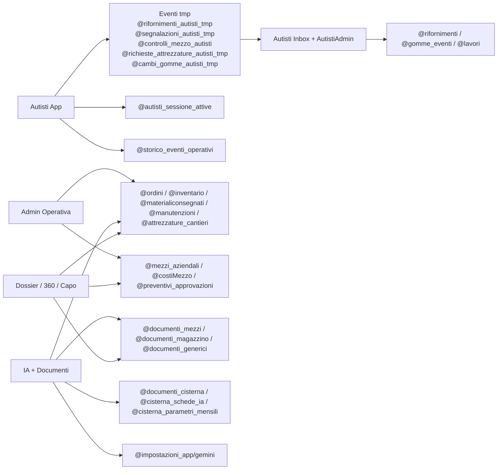

# Data Contract (UI + Dati)
Documentazione tecnica estratta da codice (`src/`) per supportare il redesign UI senza cambiare la logica applicativa.

## Macro Data-Flow

## KEY / Collection Contract
| KEY / Collection | Scopo | Writer principali | Reader principali | Schema JSON (sintesi) | Note / Rischi |
|---|---|---|---|---|---|
| `storage/@mezzi_aziendali` | Anagrafica mezzi | `Mezzi`, `IA Libretto`, `IA Copertura Libretti`, merge `storageSync` | Home, Dossier, Lavori, Autisti, Capo, IA | `[{ id, targa, categoria, marca, modello, autistaNome?, fotoUrl?, librettoUrl?, librettoStoragePath? ...}]` | Merge speciale in `setItemSync` solo su questa key. Rischio dedup per `id/targa` se non normalizzati. |
| `storage/@colleghi` | Anagrafica persone/autisti | `Colleghi` | Login autista, Materiali consegnati, Mezzi, AutistiAdmin | `[{ id, nome, badge?, ...}]` | Badge usato come credenziale lato UI (no IAM). |
| `storage/@autisti_sessione_attive` | Sessioni attive autisti e assetto mezzi | `SetupMezzo`, `CambioMezzoAutista`, `HomeAutista`, `AutistiAdmin` | Home, AutistiGate, Autista360, Mezzo360, Inbox | `[{ badgeAutista, nomeAutista, targaMotrice, targaRimorchio, timestamp, revoked? }]` | Revoche gestite via campo `revoked`; coerenza locale/cloud da verificare in edge-case offline. |
| `storage/@storico_eventi_operativi` | Storico eventi operativi (login/logout/cambio assetto) | Login/Home/Setup/Cambio autista, `AutistiAdmin` | Home, Inbox, Log accessi, Autista360, Mezzo360 | `[{ id, tipo, timestamp, badgeAutista, nomeAutista, prima?, dopo?, luogo?, statoCarico?, source }]` | Storico multi-origine; ordinamento dipende da timestamp eterogenei. |
| `storage/@rifornimenti_autisti_tmp` | Rifornimenti inseriti da autisti (feed operativo) | `Rifornimento`, `AutistiAdmin` | Inbox, CentroControllo, Dossier, 360 | `[{ id, targaCamion/targaMotrice, litri, km?, importo?, tipo, metodoPagamento?, paese?, autistaNome, timestamp, stato? }]` | Duplica parte di `@rifornimenti`; rischio doppio conteggio se merge non filtrato. |
| `storage/@rifornimenti` | Rifornimenti canonici per dossier/report | `Rifornimento` (append), `AutistiAdmin` (rettifica/import) | Dossier rifornimenti, CentroControllo | `{ items: [{ id, targa, data, litri, km, costo, distributore, note, source? }] }` | In codice compaiono sia array sia oggetto con `items`/`value`. |
| `storage/@segnalazioni_autisti_tmp` | Segnalazioni autisti con foto | `Segnalazioni`, `AutistiAdmin` | Inbox, Home, CentroControllo, 360 | `[{ id, targa, tipoProblema, descrizione, note?, fotoUrls[], fotoStoragePaths[], stato, letta, timestamp, badgeAutista }]` | Allegati su Storage; delete foto non transazionale con update record. |
| `storage/@controlli_mezzo_autisti` | Checklist controllo mezzo | `ControlloMezzo`, `AutistiAdmin` | AutistiGate, Inbox, Home, CentroControllo, 360 | `[{ id, target, targaMotrice, targaRimorchio, check:{...}, note?, obbligatorio?, timestamp, badgeAutista }]` | Schema `check` non fortemente tipizzato (chiavi variabili). |
| `storage/@richieste_attrezzature_autisti_tmp` | Richieste attrezzature autisti | `RichiestaAttrezzature`, `AutistiAdmin` | Inbox, Home, CentroControllo, 360 | `[{ id, testo, targaCamion, targaRimorchio, fotoUrl?, fotoStoragePath?, stato, letta, timestamp, badgeAutista }]` | Campi stato/letta non uniformi su record storici (DA VERIFICARE). |
| `storage/@cambi_gomme_autisti_tmp` | Eventi gomme in attesa | `GommeAutistaModal`, `AutistiAdmin` | Inbox gomme, Home events, 360 | `[{ id, targetTarga, tipoIntervento, posizione?, stato, letta, data/timestamp, autista? }]` | Modellazione gomme complessa (motrice/rimorchio, ruote multiple). |
| `storage/@gomme_eventi` | Eventi gomme ufficializzati | `AutistiAdmin` (import da tmp), `AutistiEventoModal` | Autista360, Mezzo360 | `[{ id, sourceTmpId?, targa, tipoIntervento, data, autista, note? }]` | Passaggio tmp->ufficiale non idempotente da verificare su retry. |
| `storage/@lavori` | Backlog/interventi lavoro | `LavoriDaEseguire`, `DettaglioLavoro`, `AutistiAdmin`, `AutistiEventoModal` | Lavori*, Dossier, Mezzo360 | `[{ id, gruppoId, tipo, descrizione, eseguito, targa?, urgenza?, dataInserimento, dataEsecuzione?, sottoElementi[] }]` | Origini multiple (manuale + eventi autisti). |
| `storage/@manutenzioni` | Manutenzioni programmate/eseguite | `Manutenzioni`, `AutistiEventoModal` | GestioneOperativa, Dossier, Mezzo360, GommeEconomia | `[{ id, targa, descrizione, data, manutenzioneDataFine?, materialiUsati? ...}]` | Parte schema dedotta da usage; campi completi DA VERIFICARE. |
| `storage/@inventario` | Giacenze magazzino | `Inventario`, `MaterialiConsegnati`, `Manutenzioni`, `Acquisti`, `IADocumenti` | GestioneOperativa, Acquisti, DettaglioOrdine, IA | `[{ id, descrizione, quantita, unita, fornitore?, fotoUrl?, fotoStoragePath? }]` | Aggiornato da piu moduli, rischio race su aggiornamenti concorrenti. |
| `storage/@materialiconsegnati` | Storico uscite/consegne materiali | `MaterialiConsegnati`, `Manutenzioni` | GestioneOperativa, Dossier, Mezzo360 | `[{ id, descrizione, quantita, destinatario, targa?, data, refId? }]` | Collegamento con inventario non transazionale. |
| `storage/@ordini` | Ordini materiali e stato arrivo | `Acquisti`, `MaterialiDaOrdinare`, `DettaglioOrdine` | Acquisti, OrdiniInAttesa, OrdiniArrivati | `[{ id, idFornitore, nomeFornitore, dataOrdine, materiali:[{...arrivato,dataArrivo?}], arrivato? }]` | Coesistono viste duplicate (`Acquisti` e pagine ordini dedicate). |
| `storage/@fornitori` | Anagrafica fornitori | `Fornitori` | Acquisti, MaterialiDaOrdinare, Inventario | `[{ id, nome/ragioneSociale, ...}]` | Campo nome non sempre unificato (`nome` vs `ragioneSociale`). |
| `storage/@preventivi` | Archivio preventivi strutturati | `Acquisti` | Acquisti, CapoCosti (indiretto) | `{ value: [{ id, fornitoreId, numeroPreventivo, dataPreventivo, righe[], pdfStoragePath?, imageStoragePaths? }] }` | Forte dipendenza da parsing IA e normalizzazione unita. |
| `storage/@listino_prezzi` | Prezzi canonici per materiale/fornitore | `Acquisti` | Acquisti | `{ value: [{ id, articoloCanonico, unita, valuta, prezzoAttuale, fonteAttuale, trend, updatedAt }] }` | Mapping articolo canonico fragile se descrizioni sporche. |
| `storage/@attrezzature_cantieri` | Stato e movimenti attrezzature per cantiere | `AttrezzatureCantieri` | AttrezzatureCantieri | `[{ id, cantiereId/nome, materiale, quantita, tipoMovimento, fotoUrl?, data, note? }]` | Schema inferito dal codice UI (DA VERIFICARE campi completi). |
| `storage/@costiMezzo` | Costi manuali mezzo (fatture/preventivi) | `AnalisiEconomica` (save analisi correlata), moduli costi | Dossier, CapoMezzi, CapoCosti, AnalisiEconomica | `{ items: [{ id, mezzoTarga, tipo, data, importo, valuta/currency, fornitoreLabel?, fileUrl? }] }` | Convivenza con dati IA su `@documenti_*`; dedup by source/docId. |
| `storage/@preventivi_approvazioni` | Stato approvazione preventivi | `CapoCostiMezzo` | `CapoCostiMezzo` | `[{ id, targa, status: pending/approved/rejected, updatedAt }]` | Solo modulo capo lo usa attualmente. |
| `storage/@alerts_state` | Persistenza stato alert Home (ack/snooze) | `Home` | `Home` | `{ [alertId]: { action, metaHash, snoozeUntil? ... } }` | Logica solo frontend; nessun controllo server. |
| `@documenti_mezzi` | Documenti IA legati a mezzo | `IADocumenti`, `IALibretto` | Dossier, Mezzo360, Capo*, AnalisiEconomica | `{ tipoDocumento, targa, dataDocumento, fornitore, totaleDocumento, valuta/currency, fileUrl, testo, createdAt }` | Valuta spesso `UNKNOWN` -> verifica manuale. |
| `@documenti_magazzino` | Documenti IA magazzino | `IADocumenti` | Dossier, Mezzo360, Capo*, AnalisiEconomica | Schema simile a sopra + voci articolo | Rischio classificazione errata categoria archivio. |
| `@documenti_generici` | Documenti IA non categorizzati | `IADocumenti` | Dossier, Mezzo360, Capo*, AnalisiEconomica | Schema simile | Richiede forte filtro manuale per evitare rumore. |
| `@impostazioni_app/gemini` | Config API key Gemini | `IAApiKey` | IAHome, IALibretto, IADocumenti | `{ apiKey, updatedAt? }` | Segreto lato Firestore leggibile dal client: rischio sicurezza (DA VERIFICARE policy). |
| `@analisi_economica_mezzi` | Snapshot analisi economica per targa | `AnalisiEconomica` | `AnalisiEconomica` | `docId=targa, { ...reportAnalisi, updatedAt }` | Persistenza dedicata, uso cross-modulo limitato. |
| `@documenti_cisterna` | Archivio documenti cisterna | `CisternaCaravateIA` | `CisternaCaravatePage` | `{ tipoDocumento, numeroDocumento, dataDocumento, litriTotali, totaleDocumento, valuta, fileUrl, nomeFile, daVerificare }` | Endpoint IA dedicati esterni a `aiCore`. |
| `@cisterna_schede_ia` | Righe schede cisterna estratte | `CisternaSchedeTest` | `CisternaCaravatePage`, `CisternaSchedeTest` | `{ monthKey, rows:[{data, ora, targa, litriErogati, ...}], needsReview, summary }` | Molte correzioni manuali in UI; qualita OCR variabile. |
| `@cisterna_parametri_mensili` | Parametri mese cisterna (es. cambio) | `CisternaCaravatePage` | `CisternaCaravatePage`, report | `{ mese, cambioEurChf, updatedAt }` | Campi economici non tipizzati rigidamente. |
| `collection(autisti_eventi)` | Storico Firestore alternativo eventi autisti | DA VERIFICARE (legacy) | `loadFirestoreAutistiEventi` | `[{ tipo, badgeAutista, targaMotrice, targaRimorchio, timestamp, ...}]` | Nel codice principale prevale `@storico_eventi_operativi`; uso reale da verificare. |

## Storage Path Contract
| Path Storage | Writer | Uso |
|---|---|---|
| `materiali/<materialId>-<timestamp>.<ext>` | `materialImages` (`Acquisti`, `MaterialiDaOrdinare`) | Foto materiali ordine |
| `inventario/<itemId>/foto.jpg` | `Inventario` | Foto articolo inventario |
| `autisti/segnalazioni/<recordId>/<timestamp>_<n>.<ext>` | `Segnalazioni` | Allegati segnalazione autista |
| `autisti/richieste-attrezzature/<recordId>/<timestamp>.<ext>` | `RichiestaAttrezzature` | Allegato richiesta attrezzatura |
| `mezzi_aziendali/<mezzoId>/libretto.jpg` | `IALibretto`, `IACoperturaLibretti` | Foto/libretto mezzo |
| `documenti_pdf/<...>` | `IADocumenti` | PDF documento analizzato IA |
| `documenti_pdf/cisterna/<YYYY>/<MM>/<timestamp>_<file>` | `CisternaCaravateIA` | PDF cisterna |
| `documenti_pdf/cisterna_schede/<YYYY>/<MM>/<timestamp>_<file>_crop.jpg` | `CisternaSchedeTest` | Crop immagine per OCR |
| `preventivi/ia/<...>` + `preventivi/<id>.pdf` | `Acquisti` | Upload preventivi PDF/immagini (pattern completo DA VERIFICARE) |

## IA / PDF Engine Contract
| Servizio | Chiamato da | Funzione |
|---|---|---|
| `httpsCallable(functions, "aiCore")` (region `europe-west3`) | `aiCore.ts`, `pdfEngine.ts` | Task IA centrale (`pdf_ia`) |
| `https://.../estrazioneDocumenti` | `IADocumenti` | OCR/estrazione dati documento |
| `https://.../ia_cisterna_extract` | `cisterna/iaClient.ts` | Estrazione documento cisterna (legacy) |
| `https://.../cisterna_documenti_extract` | `cisterna/iaClient.ts` | Estrazione documento cisterna (nuovo) |
| `https://.../estrazioneSchedaCisterna` | `cisterna/iaClient.ts`, `CisternaSchedeTest` | Parsing righe schede cisterna |
| `pdfEngine.ts` | Lavori, Dossier, CentroControllo, Capo, Inventario, Inbox, ecc. | Anteprima/export PDF + share/copy/WhatsApp |

## Punti Da Verificare
- `@documenti_` (chiave parziale in `DossierMezzo`) sembra filtro by-prefix, non collezione reale.
- `autisti_eventi` e ancora usata in produzione o solo fallback legacy.
- Consistenza schema completa di `@manutenzioni` e `@attrezzature_cantieri` (campi opzionali numerosi).
- Pattern definitivo Storage per allegati preventivi in `Acquisti` (sono presenti piu varianti).
